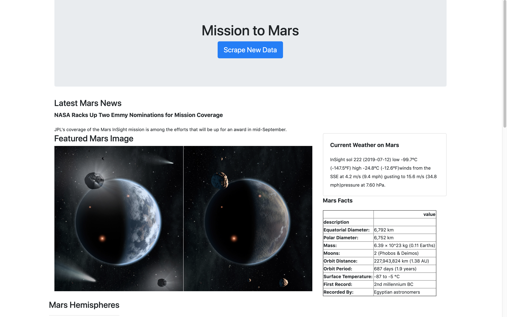

# Mission to Mars

Scraping Mars data from world wide web and store the data into MongoDB

* Source
  * https://mars.nasa.gov/news/?page=0&per_page=40&order=publish_date+desc%2Ccreated_at+desc&search=&category=19%2C165%2C184%2C204&blank_scope=Latest : for lastest mars news
  * https://www.jpl.nasa.gov/spaceimages/?search=&category=Mars: Featured image of Mars
  * https://twitter.com/marswxreport?lang=en: current Mars weather
  * https://space-facts.com/mars/: Mars facts and comparison between Mars and Earth
  * https://astrogeology.usgs.gov/search/results?q=hemisphere+enhanced&k1=target&v1=Mars: images and links to Mars hemispheres

* files: 
  * scrape_mars.py: jupyter notebook for scraping data
  * app folder: using flask to create web page to show the scraping results
    * app.py: the main program to load data from MongoDB to webpage
    * scrape_to: scraping data and storing data in MongoDB
    * templates folder: for index.html
      * index.html: webpage showing the scraping results

* webpages screen shot

